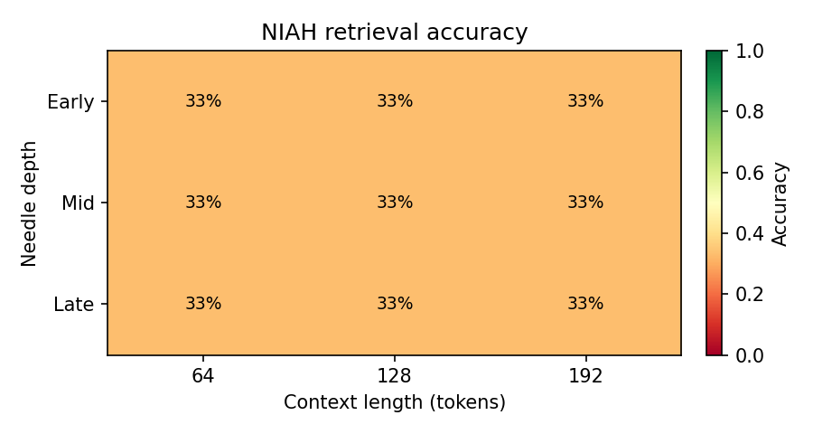

# Niah — a simple, self-contained Needle-In-A-Haystack eval

**Niah** makes it easy to add long-context Needle-In-A-Haystack (NIAH) retrieval
testing to a language model. It bundles everything end to end:

- an **open-source training loop + model** ([nanoGPT](https://github.com/karpathy/nanoGPT), MIT),
- the NIAH eval as a **standalone** run over a checkpoint **and** as a **during-training** eval,
- **charting** tools (the classic depth × context-length heatmap), and
- a ready-made **[LM Evaluation Harness](https://github.com/EleutherAI/lm-evaluation-harness)** integration.

The goal is to make NIAH testing a drop-in: train a tiny model, watch retrieval
accuracy evolve during training, then sweep context lengths and chart the result.



## The method (and why it's small-model friendly)

Most NIAH harnesses ask a model to *generate* the hidden fact and then string-match
the output. Tiny or from-scratch models rarely generate cleanly, so that signal is
noisy. Niah instead uses **likelihood-based multiple choice**:

1. Build a haystack of filler text with one needle — `The secret keyword is X.` —
   inserted at a chosen depth.
2. Ask the model to score each candidate keyword as a continuation of
   `…<haystack>\n\n### IMPORTANT DATA: The secret keyword is`. The highest-likelihood
   choice is the model's answer.
3. **Control prior:** small models have lexical biases (some words are just more
   likely). Before scoring, Niah runs the choices against a *needle-free* control
   haystack and disqualifies the ones the model already prefers a priori. This
   isolates genuine retrieval from prior preference, and Niah also reports a
   `prior_adjusted_lift` (retrieval gap minus the control margin).

No generation required, so the eval is cheap and stable even for a 10M-param model.

> **Tokenizer note:** keyword choices must be single tokens, so the model's training
> tokenizer must match the eval tokenizer. The demo trains on the **GPT-2 BPE**
> tokenizer (`gpt2`), which is the default everywhere here.

## Install

```bash
pip install -r requirements.txt
```

Core deps: `torch`, `numpy`, `tiktoken`, `matplotlib`. `transformers` (non-gpt2
tokenizers) and `lm-eval` (harness integration) are optional.

## Quickstart

```bash
# 1. Prepare the demo corpus (tiny-shakespeare, GPT-2 BPE)
python data/shakespeare/prepare.py

# 2. Train a small NIAH-capable model (add --device=cpu if you have no GPU).
#    The demo config runs the NIAH eval during training every 500 steps.
python train.py config/train_niah_demo.py

# 3. Standalone NIAH over the trained checkpoint, sweeping context lengths + charts
python scripts/run_niah.py --ckpt out-niah-demo/ckpt.pt \
    --context-length 64 128 192 --samples 8 \
    --csv-out results/niah.csv --chart results/

# 4. (optional) Re-render charts from a saved CSV/JSON
python scripts/chart_results.py results/niah.csv --out-dir results/
```

During training you'll see lines like:

```
step 500: train loss 3.95, val loss 4.81
step 500: NIAH accuracy 0.333 (retrieval gap -0.56, n=15, ctx=192)
```

> The demo is a from-scratch 10M model on ~300k tokens — accuracy stays modest. It
> exists to exercise the whole loop, not to top a leaderboard. Scale `n_layer`,
> `n_embd`, `block_size`, `max_iters`, and your corpus for real numbers.

## Add NIAH to your own training run

The eval is a single call. Given any model exposing nanoGPT's
`forward(idx, targets=None) -> (logits, loss)` and a `.config.block_size`:

```python
from niah.eval import NiahConfig, run_niah

metrics = run_niah(model, config=NiahConfig(context_length=192, num_needles=4,
                                            placements_per_needle=8))
print(metrics["accuracy"], metrics["avg_retrieval_gap_ll"])
```

`context_length` is the length of the scored model input: haystack, separator and
question (plus all but the last token of a multi-token choice). Every row is built to
exactly that many tokens, so `context_length = block_size` fits the model's full
window. The adapter reads the window from `block_size`, `max_seq_len` or
`context_length` on the model's config. Results record `input_length_min/max` and
`haystack_length_mean` so the built lengths can be checked. (Spec version
`niah-v4-spec`. Earlier `niah-v3-spec` files, where `context_length` was the haystack
alone and every prompt ran past it by the question's length, still load with that
meaning and report `length_basis: "haystack"`.)

To wire it into a training loop, copy the small `# --- NIAH ---` blocks in
[`train.py`](train.py) (config flags `niah_eval`, `niah_eval_interval`,
`niah_context_length`, …) and the `estimate_niah()` helper. Set `niah_eval = True`.

## LM Evaluation Harness

Run NIAH (or any lm-eval task) against your trained model with the bundled adapter:

```bash
python lm_eval_harness/build_dataset.py --tokens 192 --samples 5 --choices 4 \
    --out lm_eval_harness/data/niah_192.jsonl

python lm_eval_harness/run_lm_eval.py --model nanogpt \
    --model_args ckpt=out-niah-demo/ckpt.pt,device=cpu,tokenizer=gpt2 \
    --tasks niah_nanogpt --include_path lm_eval_harness --limit 20
```

See [`lm_eval_harness/README.md`](lm_eval_harness/README.md) for the full guide.

## Project layout

```
niah/                     the eval package (model-agnostic)
  spec.py                 build haystacks / needles / choices; materialize datasets
  eval.py                 run_niah(): the method (control prior + MC scoring)
  model_adapter.py        score a nanoGPT-style model (encode / logits / continuation)
  tokenizer.py            gpt2 (tiktoken) + optional Hugging Face tokenizers
  charting.py             depth × context heatmap + accuracy-vs-context line
model.py, train.py        vendored nanoGPT (MIT); train.py adds the NIAH hook
configurator.py           nanoGPT's config-override helper
config/train_niah_demo.py small, fast, NIAH-capable demo config
data/shakespeare/         GPT-2 BPE corpus prep (train.bin / val.bin)
scripts/                  run_niah.py, prepare_spec.py, chart_results.py, run_sweep.*
lm_eval_harness/          lm-eval model adapter, task YAML, dataset builder, launcher
examples/                 committed sample results + charts
```

## Metrics returned by `run_niah`

| key | meaning |
|-----|---------|
| `accuracy` | fraction of placements where the needle is the top choice (passing the retrieval-gap threshold) |
| `avg_retrieval_gap_ll` | mean log-likelihood gap between the needle and the best wrong choice |
| `avg_prior_adjusted_lift_ll` | retrieval gap adjusted for each choice's control-prior margin |
| `early_accuracy` / `mid_accuracy` / `late_accuracy` | accuracy by needle depth bucket |
| `evaluated_needles` / `disqualified_needles` | choices kept vs. removed by the control prior |

## License

MIT. The vendored nanoGPT files (`model.py`, `train.py`, `configurator.py`,
`data/shakespeare/prepare.py`) are © Andrej Karpathy; see [LICENSE](LICENSE).
